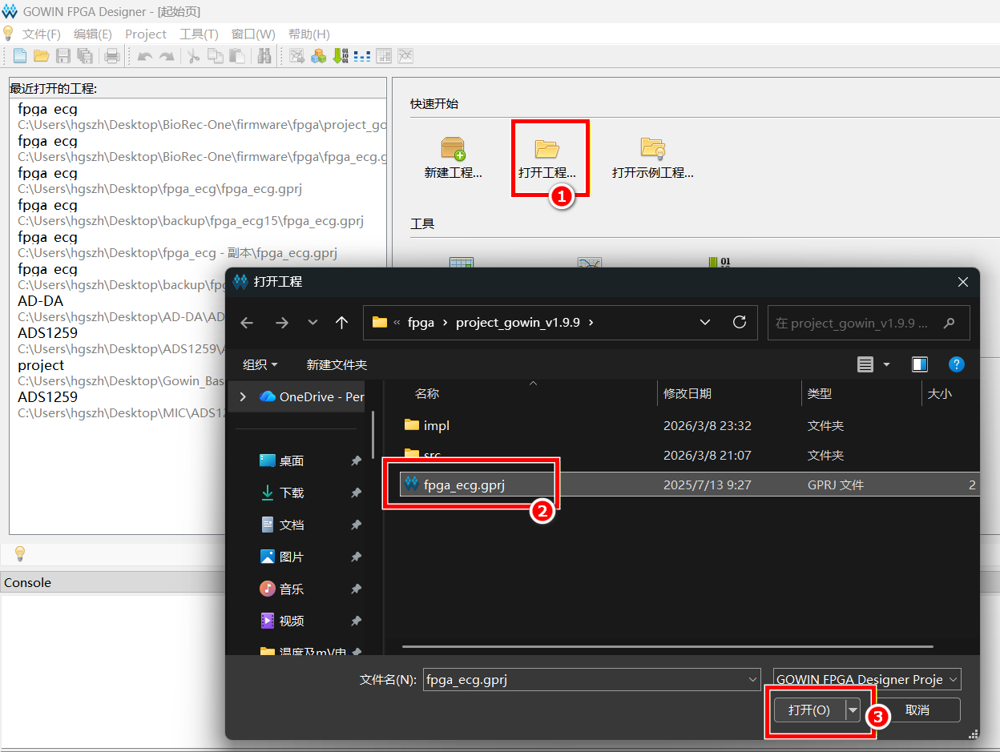
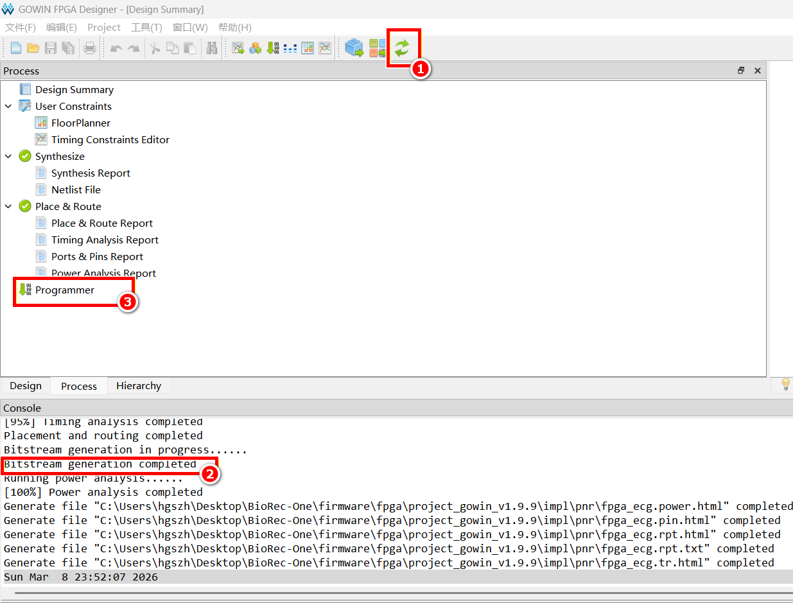
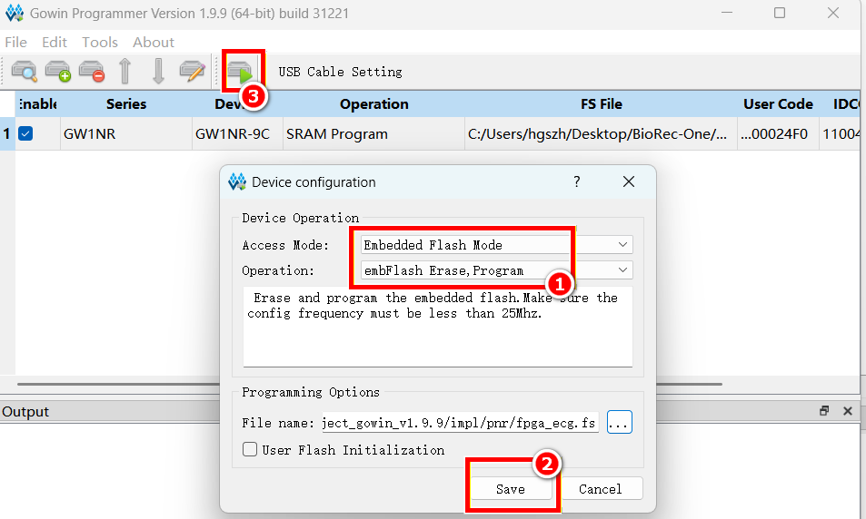

## FPGA 比特流烧录说明

### 准备工作

安装 Gowin IDE（云源），Tang Nano 9K 使用教育版即可，无需 License：

- 下载地址：[www.gowinsemi.com.cn/faq.aspx](http://www.gowinsemi.com.cn/faq.aspx)
- 安装说明：[Sipeed Wiki - 安装 IDE](https://wiki.sipeed.com/hardware/zh/tang/common-doc/get_started/install-the-ide.html)

---

### 编译工程

**① 打开工程**

启动 Gowin IDE，点击 `打开工程...`，进入 `project_gowin_v1.9.9/` 目录，选择 `fpga_ecg.gprj` 打开。

**② 编译并生成比特流**

点击工具栏中的 `Run All`（绿色循环箭头），等待 Console 输出 `Bitstream generation completed`。

---

### 烧录

**③ 打开 Programmer**

编译完成后，双击左侧 Process 面板中的 `Programmer`。

**④ 配置烧录模式**

在 Programmer 中双击设备行，弹出 Device configuration 窗口，按下图配置：

- `Access Mode` → `Embedded Flash Mode`
- `Operation` → `embFlash Erase, Program`

点击 `Save` 保存配置。

**⑤ 开始烧录**

点击工具栏中的运行按钮，等待烧录完成。烧录写入 Flash，断电后程序不丢失。
