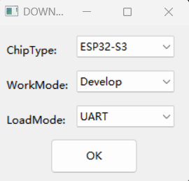
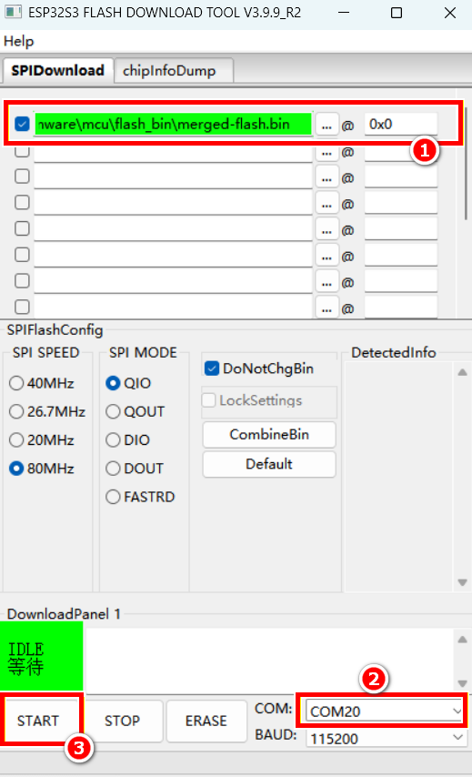
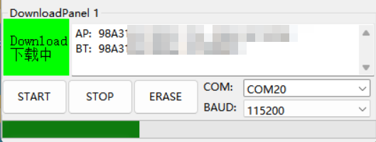

## 固件烧录说明

### 准备工作

使用 USB Type-C 数据线将主板连接到电脑，确保已安装 [CH340C 驱动](https://www.wch.cn/downloads/CH341SER_EXE.html)。
安装成功后，在设备管理器中可以看到对应的串口设备，记下端口号（如 `COM20`）。

### 烧录步骤

1. 进入 `flash_download_tool/` 目录，双击打开 `flash_download_tool_x.x.x.exe`。

2. 在启动界面中选择以下配置，然后点击 `OK`：
   - `chipType` → `ESP32S3`
   - `workMode` → `develop`
   - `loadMode` → `usb`

   

   
   

3. 在下载工具主界面中完成以下配置：
   - 选择 `merged-flash.bin`，地址填写 `0x0`
   - 选择对应的串口（如 `COM3`）
   - 点击 `START` 开始烧录

   

   
   

4. 工具提示 `FINISH` 后，烧录完成。

   

   
   

> 烧录完成后请重新插拔数据线上电，程序即可启动。